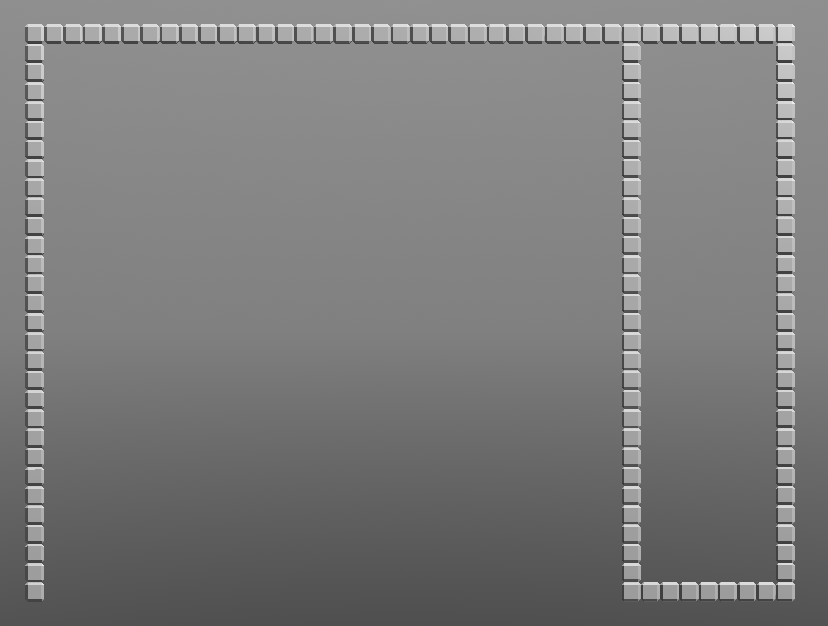
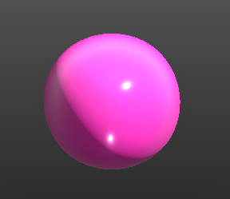
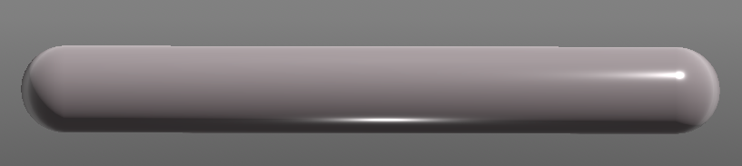
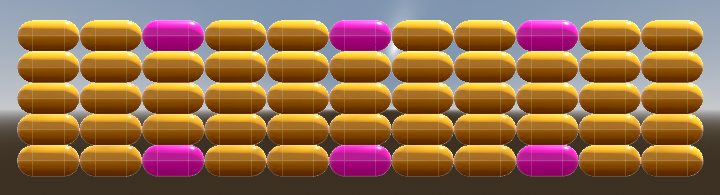
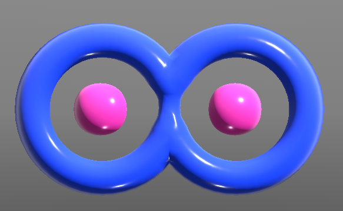

# Paddles, Balls, Blocks, and Walls

Design Document

**Game Overview**  
This game is essentially a clone of the once popular video game “Breakout” that appeared in late 70s and was popularized by Atari.

The basic components of the game are as follows:

**Walls** \- These are normally positioned on the top, left and right sides of the game window.  They serve as barriers to prevent the ball from exiting the gameplay area.  The only way the ball can escape the board is from the bottom of the screen.

*Ex 01 \- A screenshot of the “Walls” used in Paddles, Balls, Blocks, and Walls\!*

**Ball** \- These are normally released one at a time, and move upwards towards the blocks, break the blocks, bounce off the blocks and walls, and then travel towards the bottom of the board.   They can escape the board from the bottom if the player does not block them with the paddle.  

*Ex 02 \- What a ball looks like in PBBW*

**Paddle** \- This is the component that the player controls directly, in modern times usually with a mouse.  It normally appears at the bottom of the screen and can move left and right.  If the ball comes into contact with it, it bounces upward.  

*Ex 03 \- What a paddle looks like in PBBW.*

**Blocks** \- These are usually positioned along the top part of the board, and often have colors or patterns to indicate things like score value, or special effects that occur when destroyed by the ball.  Different block types can allow for almost endless variations in the game.  A popular example would be a block that once destroyed, releases an extra ball or powerup in its place.  

*Ex 04 \- Yellow and Pink blocks as they appear in PBBW.  Pink blocks release various power-ups.*

**PowerUps** \- These are extremely common additions which appear upon the destruction of certain block types, causing a particular type of shape to appear in its place and then travel downwards towards the bottom of board.  If this shape is “caught” by the paddle, a new rule that changes the gameplay in some type of way will take effect for a certain amount of time.  An example of this would be a powerup that changes the paddle size or the ball size.  

*Ex 05 \- The “Infinite Balls” power-up shape from PBBW.  When caught by the paddle the player can release any amount of balls during its timer duration without affecting the number of spare balls the player has in reserve.*

## Game Modes

PBBW currently supports two game modes, Timed and Arcade.

### Timed Game Mode

In "Timed" game mode, the player gets 10 spare balls at the beginning of every stage.  The player has the option to release as many of these spare balls as desired during the course of the stage, either by right-clicking or using the Ball Gun (keyboard shortcut G). The focus is on completing stages as fast as possible.  If the player loses all 10 balls before completing the stage, the stage can be restarted.  At the completion of each stage, the game checks to see if the player's previous record time has been beaten, and if so reports it.  It also checks "total record time" which represents the total accumulated time of completing all the stages up to and including the last completed stage.  If this record time has been beaten the game also reports it.

### Arcade Game Mode

In "Arcade" game mode, the player gets 3 balls at the beginning of the first stage. The player may only release one ball at a time.  When blocks are destroyed in this mode, score is accumulated.  Every 10,000 points the player receives an extra spare ball. When all three balls are lost the game ends.  The player can restart the stage but only gets the number of balls and score that was present at the start of the stage.  This game mode should encourage the player to think somewhat more strategically about how to approach completing each stage, and spend more time learning how to control the ball with good paddle positioning.

## Godot Scene Node Hierarchy

**Main** - The main scene serves a code entry point (after autoloaded scenes and scripts), but mainly as a container for all other scenes that make up the game.
**Stage** - Child of Main.  Contains the wall meshes and their collision shapes, the spare balls display, labels indicating stage number, current times, items, score, blocks left, best stage time, best total time,  a timer to display "Ready Set Go!", and an AudioStreamPlayer.  This scene should be loaded dynamically after the interaction with the main menu at the beginning of the game.  At the start of each new stage, blocks from the "stage_blocks" folder, which  correspond with the upcoming stage, should be instantiated and added as a child of stage.  This scene should either check for, or cooperate in stage completion or game over events.  At these events the stage needs to be cleared of all blocks, pickup items, and anything else that doesn't need to be active at that time.  The proper labels or menus need to be displayed to shows stats and provide a way to move to the next game state.